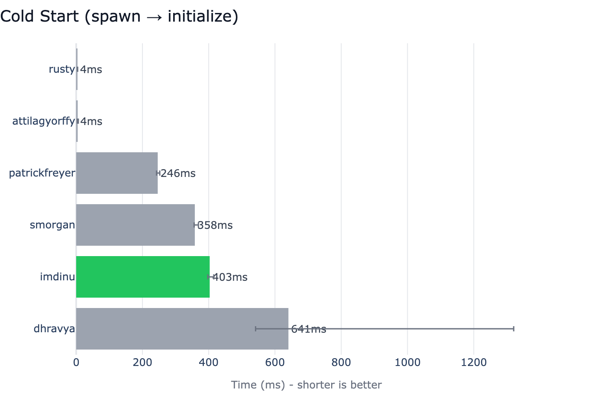
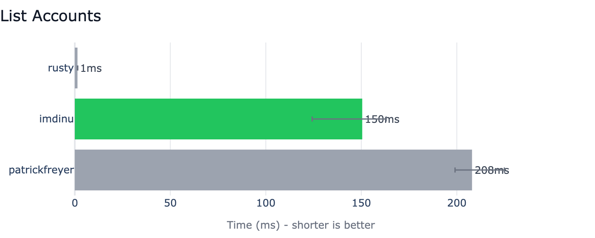
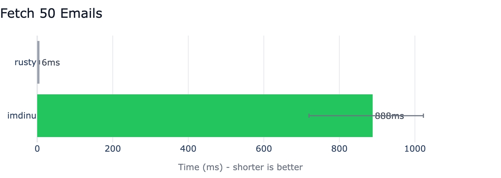
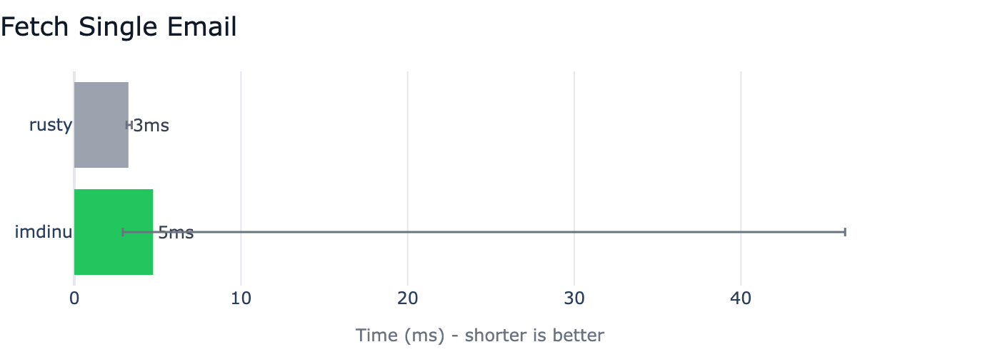
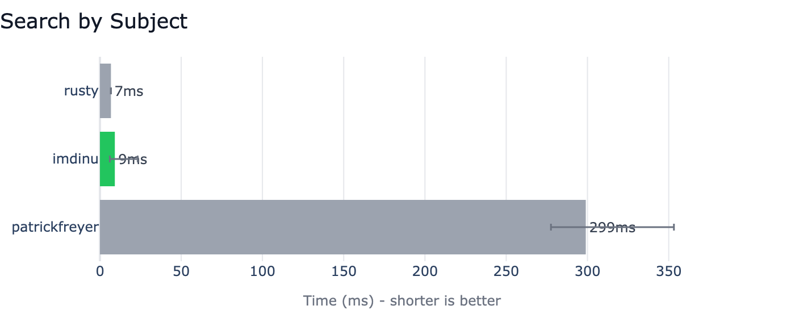
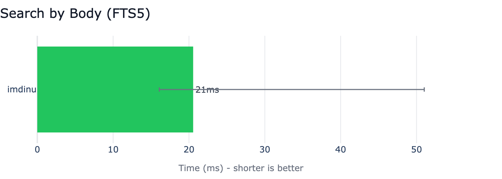

# Benchmarks

Competitive benchmarks comparing Apple Mail MCP against 6 other Apple Mail MCP servers — inspired by [uv's BENCHMARKS.md](https://github.com/astral-sh/uv/blob/main/BENCHMARKS.md).

All benchmarks are run at the **MCP protocol level**: we spawn each server as a subprocess, connect as a JSON-RPC client over stdio, and time real tool calls. This measures what an AI assistant actually experiences.

## The Big Picture

On a real **30K+ email mailbox**, most Apple Mail MCP servers timeout or crash on basic operations. Apple Mail MCP is the only server that **completes all 6 operations** — and the only one with **full-text body search**.


### What This Means

- **4 of 6 competitors** cannot fetch emails or search on large mailboxes — AppleScript-based servers hit 60-second timeouts
- **Body search** (searching email content, not just subjects) is exclusive to Apple Mail MCP via FTS5 indexing
- **Single email fetch** at 5ms rivals the native Rust implementation (3ms) thanks to direct `.emlx` disk reads
- The Rust server (`rusty`) is fastest on metadata operations — but does not support body search

## Test Environment

| Property | Value |
|----------|-------|
| **macOS** | 26.3.1 (Tahoe) |
| **Chip** | Apple M4 Max |
| **Python** | 3.12.0 |
| **Date** | 2026-03-23 |

## Competitors

| # | Project | Type | Notes |
|---|---------|------|-------|
| 1 | **[imdinu/apple-mail-mcp](https://github.com/imdinu/apple-mail-mcp)** (ours) | Python | Disk-first + batch JXA + FTS5 |
| 2 | **[rusty_apple_mail_mcp](https://github.com/like-a-freedom/rusty_apple_mail_mcp)** | Rust | Reads Apple's Envelope Index directly |
| 3 | **[patrickfreyer/apple-mail-mcp](https://github.com/patrickfreyer/apple-mail-mcp)** | Python | AppleScript-based, 26+ tools |
| 4 | **[attilagyorffy/apple-mail-mcp](https://github.com/attilagyorffy/apple-mail-mcp)** | Go | AppleScript-based |
| 5 | **[s-morgan-jeffries/apple-mail-mcp](https://github.com/s-morgan-jeffries/apple-mail-mcp)** | Python | AppleScript-based |
| 6 | **[dhravya/apple-mcp](https://github.com/supermemoryai/apple-mcp)** | TypeScript | Multi-app (archived Jan 2026) |

## Detailed Results

Each scenario: **5 warmup runs + 10 measured runs**. We report the **median** with **p5/p95** error bars. A single probe call screens out tools that exceed 10 seconds, and responses are validated for correctness.

### Cold Start

Time from spawning the server process to receiving an MCP `initialize` response. Native binaries (Rust, Go) have a natural advantage here — no interpreter startup.



### List Accounts



### Fetch 50 Emails

Only Apple Mail MCP and the Rust server complete this operation. All AppleScript-based competitors timeout or crash.



### Fetch Single Email

Our disk-first strategy reads `.emlx` files directly — no JXA needed. Performance is within 1.5x of the native Rust implementation.



### Search by Subject

FTS5 column filtering gives us sub-10ms subject search, competitive with the Rust server's direct SQLite queries.



### Search by Body

**We are the only server that supports body search** — searching the actual content of emails, not just metadata. FTS5 delivers results in ~20ms.



## Methodology

- **Protocol**: MCP over JSON-RPC/stdio (spawn subprocess, connect, time tool calls)
- **Warmup**: 5 runs discarded before measurement
- **Measured**: 10 runs per scenario
- **Statistic**: Median (robust to outliers)
- **Variance**: p5/p95 shown as error bars
- **Tool calls**: For non-cold-start scenarios, a single server process handles all runs
- **Probe screening**: A single probe call runs before warmup; if it exceeds 10s the scenario is skipped
- **Response validation**: Tool responses are checked for hidden errors (e.g. `{"success": false}` inside valid MCP content)

## Caveats

1. **Mailbox size matters.** Results depend on the number of emails. Our test mailbox has 30K+ emails — AppleScript-based servers struggle at this scale.
2. **FTS5 requires one-time indexing.** Body and subject search require `apple-mail-mcp index` first. Cold start time does not include indexing.
3. **Not all servers support all operations.** The capability matrix above shows which operations each server supports.
4. **macOS and Mail.app versions matter.** Performance varies across OS versions.
5. **Archived projects benchmarked as-is.** dhravya/apple-mcp is archived with known bugs.

## Reproduction

```bash
# Install competitors
bash benchmarks/setup.sh

# Run all benchmarks
uv run --group bench python -m benchmarks.run

# Generate charts
uv run --group bench python -m benchmarks.charts

# Single competitor or scenario
uv run --group bench python -m benchmarks.run --competitor imdinu
uv run --group bench python -m benchmarks.run --scenario cold_start
```

See the [benchmarks suite](https://github.com/imdinu/apple-mail-mcp/tree/main/benchmarks) in the repository for harness code and competitor configs.
